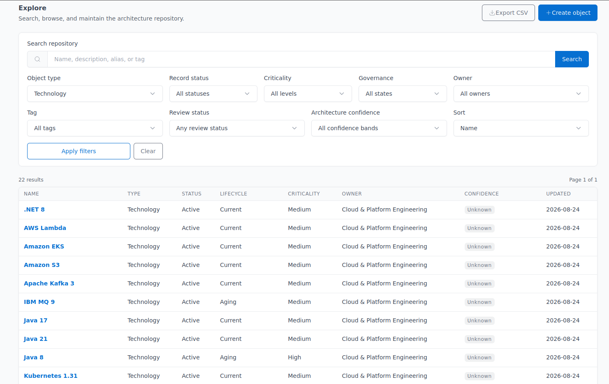
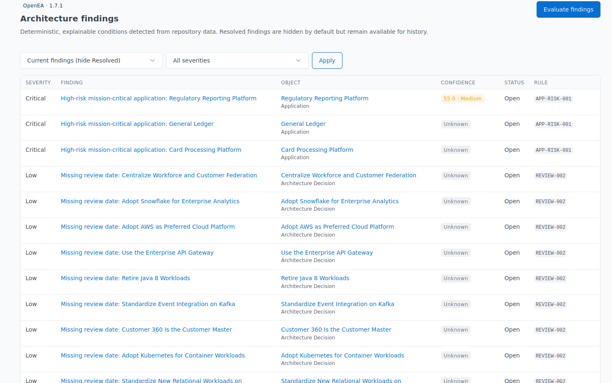
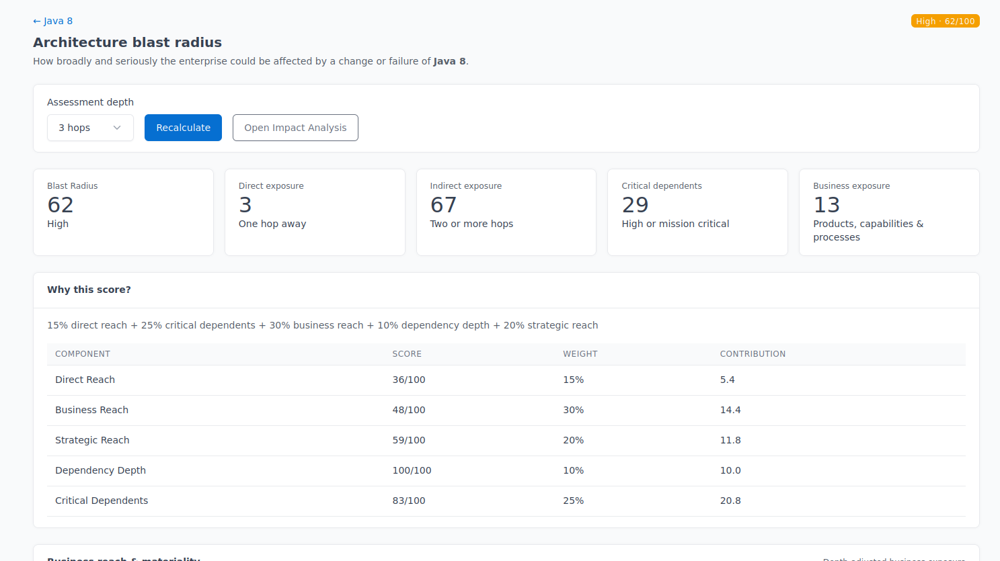

<div align="center">


# OpenEA

### Open-source Enterprise Architecture for modern organizations

[](https://openea.dev)
[](https://demo.openea.dev)
[](https://github.com/openeadev/openea-community)
[](https://www.gnu.org/licenses/agpl-3.0)

**[Website](https://openea.dev)** ·
**[Try OpenEA](https://openea.dev/try/)** ·
**[Live Demo](https://demo.openea.dev)** ·
**[Community Source](https://github.com/openeadev/openea-community)**

</div>

---

## About OpenEA

**OpenEA** is an Enterprise Architecture knowledge and decision-support platform designed to help organizations understand how their business capabilities, applications, technologies, data, initiatives, ownership, and architecture decisions fit together.

OpenEA uses a **repository-first** approach. Architecture objects and their relationships form the authoritative enterprise architecture model. Visualizations, analytics, findings, impact analysis, portfolios, and roadmaps are derived from that structured information.

OpenEA is intended to help architects answer questions such as:

* What business capabilities does this application support?
* Which applications support a particular business capability?
* What technologies does an application depend on?
* Which technologies are approaching end of support?
* What is affected if an application or technology is retired?
* Which initiatives are changing the same parts of the architecture?
* Where are architecture risks and gaps emerging?
* Which applications lack accountable ownership?
* Why was a particular architecture or technology decision made?

The goal is not simply to inventory technology. OpenEA connects technology to the business context that explains why it matters.

---

## OpenEA Community

**OpenEA Community** is the open-source edition of OpenEA.

It provides a self-hosted Enterprise Architecture Management platform for organizations, architects, technology teams, and anyone evaluating EA tools.

Community capabilities include:

* Governed enterprise architecture repository
* Business capability management
* Business process modeling
* Application portfolio information
* Technology portfolio information
* Data architecture objects
* Organizations and roles
* Initiatives and projects
* Architecture principles
* Architecture decisions
* Governed architecture relationships
* Lifecycle and criticality information
* Repository search and filtering
* Architecture impact analysis
* Deterministic findings and analytics
* Portfolios
* Roadmaps
* Reviews and governance
* Comments and audit history
* CSV object import
* CSV relationship import
* REST API
* Personal access tokens
* Service accounts
* Declarative custom finding rules
* Light and dark themes

OpenEA Community is licensed under the **GNU Affero General Public License v3.0 (AGPLv3)**.

### Community Source

https://github.com/openeadev/openea-community

---

## Try OpenEA

A public OpenEA Community demonstration environment is available for anyone who wants to evaluate the platform without installing it.

### Demo

**https://demo.openea.dev**

Demo credentials and additional information are available at:

**https://openea.dev/try/**

The demo contains a populated enterprise architecture repository so you can immediately explore the application rather than starting with an empty environment.

You can:

* Browse architecture objects and relationships
* Create architecture records
* Edit existing records
* Archive records
* Explore application and technology dependencies
* Run impact analysis
* Review architecture findings
* Explore analytics
* Examine portfolios and roadmaps
* Test light and dark themes

The hosted demo uses shared demonstration infrastructure. Data may be reset periodically as new OpenEA Community versions are deployed.

---

## Screenshots

### Architecture Repository



OpenEA provides a governed repository for managing the objects that make up an organization's enterprise architecture.

### Architecture Findings



Deterministic findings help identify architecture conditions that deserve attention while preserving an explainable connection to the underlying repository data.

### Blast Radius and Impact Analysis



Architecture relationships allow OpenEA to analyze dependencies and help architects understand what may be affected by a proposed change.

---

## Core Principles

### Repository First

Architecture objects and their relationships constitute the authoritative architecture model.

Diagrams, dashboards, portfolios, roadmaps, findings, impact analysis, and other views are derived from that model rather than maintained as disconnected artifacts.

### Business Context Matters

Technology should be connected wherever possible to applications, business capabilities, processes, products, data, ownership, initiatives, and architecture decisions.

OpenEA is intended to explain not only **what technology exists**, but **why it matters to the enterprise**.

### Governed but Extensible

OpenEA provides an opinionated Enterprise Architecture metamodel and governed relationship vocabulary while allowing the platform to evolve as organizational needs grow.

### Explainable Analytics

Architecture findings and analytical outputs should be deterministic and understandable.

Users should be able to determine why a finding or analytical result was produced.

### Preserve History

Architecture evolves over time. OpenEA favors preserving history, archiving records, and superseding decisions rather than silently deleting or overwriting important architectural context.

### Simple Self-Hosting

OpenEA is designed to remain straightforward to deploy and operate.

The platform avoids introducing infrastructure simply because it is common in large enterprise software stacks.

---

## Community and Enterprise

OpenEA is developed in two editions.

### OpenEA Community

The Community edition is the open-source OpenEA distribution:

```text
openea-community
```

It provides the core repository, governance, relationship, analysis, findings, portfolio, roadmap, API, and self-hosting capabilities.

### OpenEA Enterprise

OpenEA Enterprise is developed separately from the Community edition and extends the platform with additional capabilities intended for more complex enterprise environments.

The two editions maintain independent release lifecycles. Features are not automatically transferred between editions.

---

## Technology

OpenEA Community uses a deliberately straightforward architecture.

### Backend

* Python
* FastAPI
* SQLAlchemy
* Pydantic
* Alembic
* PostgreSQL

### Frontend

* Jinja2
* HTMX
* Tabler
* Lucide
* Cytoscape.js
* Focused JavaScript modules

### Deployment

* Docker
* Docker Compose
* PostgreSQL

OpenEA uses a server-rendered application architecture rather than requiring a JavaScript SPA or Node.js build environment.

---

# About This Repository

This repository contains the static public website for:

**https://openea.dev**

The website is intentionally built with plain HTML, CSS, and JavaScript so it can be hosted directly on **GitHub Pages** without a framework, package manager, or build process.

It is separate from the OpenEA Community application source code.

---

## Website Structure

```text
/
├── index.html
├── 404.html
├── CNAME
├── robots.txt
├── sitemap.xml
├── site.webmanifest
│
├── assets/
│   ├── css/
│   │   └── styles.css
│   │
│   ├── js/
│   │   └── main.js
│   │
│   └── img/
│       ├── favicon.svg
│       ├── openea-mark.svg
│       ├── openea-wordmark.svg
│       ├── openea-social.png
│       │
│       └── screenshots/
│           ├── repository.png
│           ├── findings.png
│           └── blast-radius.png
│
├── community/
│   └── index.html
│
├── docs/
│   └── index.html
│
├── download/
│   └── index.html
│
├── releases/
│   └── index.html
│
└── try/
    └── index.html
```

---

## Local Development

No build tools or dependencies are required.

From the repository root, start a local HTTP server:

```bash
python3 -m http.server 8000
```

Then open:

```text
http://localhost:8000
```

Using a local HTTP server is recommended rather than opening `index.html` directly because the site is designed to operate as a web application served over HTTP or HTTPS.

---

## GitHub Pages Deployment

The website is hosted using GitHub Pages.

The normal deployment workflow is:

```text
Website change
      ↓
Test locally
      ↓
Commit
      ↓
Push to GitHub
      ↓
GitHub Pages deploys
      ↓
https://openea.dev
```

The custom OpenEA domain is configured through the repository's:

```text
CNAME
```

file.

The site requires no server-side application, database, build pipeline, or package installation.

---

## Search and Social Metadata

The site includes assets and metadata intended to support search engines and social sharing.

Relevant files include:

```text
robots.txt
sitemap.xml
site.webmanifest
assets/img/openea-social.png
```

Individual public pages should provide appropriate:

* Page titles
* Meta descriptions
* Canonical URLs
* Search-engine indexing directives
* Open Graph metadata
* Social preview metadata

Pages that are not intended to appear in search results can use `noindex` until they contain public content.

---

## Contributing

OpenEA is under active development.

For OpenEA Community application issues, feature ideas, bug reports, or code contributions, use the Community repository:

**https://github.com/openeadev/openea-community**

Changes related specifically to the `openea.dev` website can be submitted through this repository.

---

## Project Links

| Resource            | Link                                          |
| ------------------- | --------------------------------------------- |
| OpenEA              | https://openea.dev                            |
| Try OpenEA          | https://openea.dev/try/                       |
| Live Community Demo | https://demo.openea.dev                       |
| OpenEA Community    | https://github.com/openeadev/openea-community |
| OpenEA on GitHub    | https://github.com/openeadev                  |

---

## Project Status

OpenEA is actively being developed.

The Community platform, documentation, public website, demonstration environment, and future OpenEA capabilities will continue to evolve as the project develops.

---

## Google Analytics and Privacy

The production site uses **Google Analytics 4** with measurement ID:

```text
G-VBNM5LKVBF
```

Analytics is implemented in:

```text
assets/js/analytics.js
```

The implementation uses **Basic Consent Mode**:

* Google Analytics is blocked until the visitor explicitly allows analytics.
* No Google Analytics request is sent when a new visitor declines analytics.
* `analytics_storage` is granted only after opt-in.
* `ad_storage`, `ad_user_data`, and `ad_personalization` remain denied.
* The visitor's choice is stored locally as `openea.analyticsConsent.v1`.
* Visitors can reopen the consent controls through **Analytics settings** links or the `/privacy/` page.

The site records standard GA4 page measurement plus these OpenEA-specific events:

| Event | Meaning |
| --- | --- |
| `try_openea` | Visitor follows a Try OpenEA link |
| `demo_launch` | Visitor launches `demo.openea.dev` |
| `github_visit` | Visitor follows a GitHub link |
| `docs_open` | Visitor opens documentation |
| `download_open` | Visitor opens the download area |
| `releases_open` | Visitor opens release information |

The privacy notice is published at:

```text
https://openea.dev/privacy/
```

### Verify analytics after deployment

1. Deploy the site to GitHub Pages.
2. Open `https://openea.dev` in a private/incognito window.
3. Confirm that no request to `googletagmanager.com` is made before consent.
4. Select **Allow analytics**.
5. Confirm that `gtag/js?id=G-VBNM5LKVBF` loads.
6. Open Google Analytics **Reports → Realtime** and confirm the visit appears.
7. Launch the demo or follow another tracked CTA and confirm the custom event appears in Realtime/DebugView after processing.
8. Reopen **Analytics settings**, select **Decline**, and confirm the page reloads without loading the Google tag.

If an event should be treated as a primary conversion for the project, mark it as a **key event** in the GA4 property. `demo_launch` is the strongest initial candidate.


## Documentation site

The public OpenEA documentation is hosted separately at:

`https://docs.openea.dev/`

Documentation links on the marketing site open in a new browser tab/window using
`target="_blank"` with `rel="noopener noreferrer"`. The legacy `/docs/` path is
retained as a redirect for old bookmarks and inbound links.

The `docs_open` Google Analytics event recognizes links to `docs.openea.dev`.

